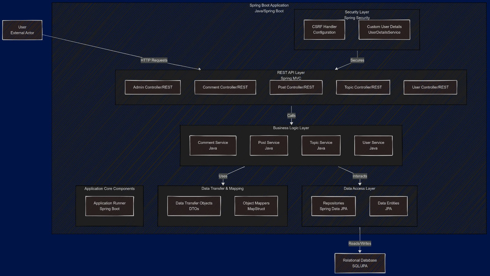

# CodeHub 

| Usuario de GitHub       | Nombre                            | Correo electrónico                           |
|-------------------------|-----------------------------------|----------------------------------------------|
| [Sonaca](https://github.com/Sonaca)      | Diego Ismael Cantador Trapero | di.cantador.2022@alumnos.urjc.es |
| [CazaMopis43](https://github.com/CazaMopis43) | Marc Burgos Ucendo           | m.burgos.2022@alumnos.urjc.es |
| [ASastre03](https://github.com/ASastre03)    | Alberto Sastre Zorrilla      | a.sastrez.2022@alumnos.urjc.es |

# Indice
-[Entidades](#Entidades)

-[Herramientas](#Herramientas)

-[Diagrama de clases y Templates](#DiagramadeclasesyTemplates)

-[Diagrama de Entidades](#DiagramadeEntidades)

-[Diagrama de la base de Datos](#DiagramadelabasedeDatos)

-[Instrucciones de ejecución](#Instruccionesdeejecución)

# Entidades   :shipit:

Username-> Es la entidad del usuario

Topic-> Entidad que referencia los Temas

Post-> Entidad que referencia a las Publicaciones

Comment-> Son los comentarios de una Publicación

# Herramientas
Para la realización de esta práctica hemos utilizado la extensión de Visual Studio de Live Share, la cual nos ha permitido trabajar simultáneamente sin necesidad de estar haciendo diversos commits para tener el codigo actualizado

# Imágenes
El ususario tiene un atributo llamado profilePicture que es la foto de perfil

# Diagrama de clases y Templates

# Diagrama de Entidades

# Diagrama de la base de Datos

# Diagrama de pantallas 

# 🧭 NAVIGATION

## **LOGIN**

Esta es la pantalla que encontramos nada más iniciar la web. Desde ella podemos inciar sesión o bien crear un usuario. 

## **SIGN UP**

Esta pantalla nos permite crear un usuario introduciendo usuario,email y constraseña. Nos llevará a Log In.

## **POST**

Esta es la Pantalla post, en ella podemos ver todos los posts que se han creado. Desde aquí podemos volver a la pantalla Inicial, ver el post en detalle o crear un post si así lo deseamos.

## **ADD POST**

Aquí podemos Crear un post en el que estableceremos un Titulo, el cuerpo del Post y el topic al que está  asociado.

## **SHOW MORE POSTS**

Aquí podemos ver en detalle el post, viendo así su Creador, su título, su contenido y sus comentarios asociados si es que los tuviera.

## **TOPIC**

En el apartado Topic podemos ver todos los topics que existen. Desde aquí podemos crear un Topic nuevo, volver o expandir el topic para ver los posts que este tiene asociados.

## **ADD TOPIC**

Esta es la pantalla para crear un topic, en ella se solicita el nombre que se quiere poner al nuevo topic.

## **POST BY TOPIC**

Esta es la pantalla que expande un topic. En ella podemos ver todos los posts asociados así como el poder borrar un post o expandirlo, o eliminar el topic.

## **CREATE COMMENT**

Para crear un comment necesitarmeos estar dentro de un post y se nos solicitará el contenido de nuestro comment.

## **PROFILE**

Este es el apartado de perfil, en el podremos ver tanto nuestro user como el mail, así como la foto que hemos puesto de perfil y podremos mostrar nuestra constaseña si así lo queremos.

## **INIT**

Esta es la pantalla que aparece cuando entras al menú principal, desde donde se accede a todo.

# Instrucciones de ejecución

1.Descargar el repositorio y descomprimirlo en una carpeta.

2.Descargar MySQL Configurator y MySQL Worckbench.

3.En MySQL Configurator poner Usuario: root, Password: password y el puerto predeterminado (3306).

4.En MySQL Worckbench añadir una conexión con el usuario y password previamente introducidos.

5.Crear un esquema llamado CodeHub en la conexión anterior.

6.Ejecutar la aplicación.

7.Ir a http://localhost:8080/

# COMMITS MÁS SIGNIFICATIVOS

 ## Marc Burgos Ucendo:
- Creación de un nuevo topic: https://github.com/SSDD-2025/practica-sistemas-distribuidos-2025-grupo-2/commit/d80568626762a5f0aafa47c2f4418aae2d0e071d
- Eliminar Topic: https://github.com/SSDD-2025/practica-sistemas-distribuidos-2025-grupo-2/commit/0e94cf509439b6e6940201774367081dd43a89a8
- Pantalla de error y redirecciones: https://github.com/SSDD-2025/practica-sistemas-distribuidos-2025-grupo-2/commit/700bdab79e0c32da5ef5b553aa51d07798937cb8
- Creacion de entidades y respositorios: https://github.com/SSDD-2025/practica-sistemas-distribuidos-2025-grupo-2/commit/40972388021984471d55d343570c06a0396e0225 
- Creación de postBy topic: https://github.com/SSDD-2025/practica-sistemas-distribuidos-2025-grupo-2/commit/59ff25352c1ead0d6007078af8d8aea30fcb9278
 ### Archivos Importantes
 - Control: https://github.com/SSDD-2025/practica-sistemas-distribuidos-2025-grupo-2/blob/main/src/main/java/codehub/grupo2/Control.java
 - addTopic.html: https://github.com/SSDD-2025/practica-sistemas-distribuidos-2025-grupo-2/blob/main/src/main/resources/templates/addTopic.html
 - topic: https://github.com/SSDD-2025/practica-sistemas-distribuidos-2025-grupo-2/blob/main/src/main/resources/templates/topic.html
 - Error: https://github.com/SSDD-2025/practica-sistemas-distribuidos-2025-grupo-2/blob/main/src/main/resources/templates/error.html
 - Topic: https://github.com/SSDD-2025/practica-sistemas-distribuidos-2025-grupo-2/blob/main/src/main/java/codehub/grupo2/DB/Entity/Topic.java

 
## Alberto Sastre Zorrilla:
- Inicio de Sesión, Crear Usuario: https://github.com/SSDD-2025/practica-sistemas-distribuidos-2025-grupo-2/commit/c339cf3740f30d5eb10c002b136e7bb96c70c045
- Css & HTML: https://github.com/SSDD-2025/practica-sistemas-distribuidos-2025-grupo-2/commit/8086f71fc1eb0891b5d712de2b87b14c323dc7bd
- Intento de arreglo & Comment: https://github.com/SSDD-2025/practica-sistemas-distribuidos-2025-grupo-2/commit/a065093cce0f6b72331be9ab6a2a65c11ed381ed
- Topic & Comment: https://github.com/SSDD-2025/practica-sistemas-distribuidos-2025-grupo-2/commit/05cccb4aa7865b613c651d60dd2ae83deea56587
- Post & Reestructuración: https://github.com/SSDD-2025/practica-sistemas-distribuidos-2025-grupo-2/commit/d7f66d3ea811e9c98d64703239ea8cb00cb634b0

 ### Archivos Importantes
 -Control: https://github.com/SSDD-2025/practica-sistemas-distribuidos-2025-grupo-2/blob/main/src/main/java/codehub/grupo2/Control.java
 
 -Comment: https://github.com/SSDD-2025/practica-sistemas-distribuidos-2025-grupo-2/blob/main/src/main/java/codehub/grupo2/DB/Entity/Comment.java
 
 -Post: https://github.com/SSDD-2025/practica-sistemas-distribuidos-2025-grupo-2/blob/main/src/main/java/codehub/grupo2/DB/Entity/Post.java
 
 -Inti.css: https://github.com/SSDD-2025/practica-sistemas-distribuidos-2025-grupo-2/blob/main/src/main/resources/static/init.css
 
 -Init.html: https://github.com/SSDD-2025/practica-sistemas-distribuidos-2025-grupo-2/blob/main/src/main/resources/templates/init.html

## Diego Ismael Cantador Trapero

-Edición de perfil y mejora borrado comentarios: https://github.com/SSDD-2025/practica-sistemas-distribuidos-2025-grupo-2/commit/6c573be51b087c08327ae15c8a538546ee3d24a1

-Creacion de componentes: https://github.com/SSDD-2025/practica-sistemas-distribuidos-2025-grupo-2/commit/a22431e65eaedfd9028fb0a1e721e3f5bc19ca7e

-Inicio creación Servicios: https://github.com/SSDD-2025/practica-sistemas-distribuidos-2025-grupo-2/commit/f30e731699631170499de6360d777edd4c121f75

-Implementación de H2: https://github.com/SSDD-2025/practica-sistemas-distribuidos-2025-grupo-2/commit/c339cf3740f30d5eb10c002b136e7bb96c70c045

-Añadida foto de usuario: https://github.com/SSDD-2025/practica-sistemas-distribuidos-2025-grupo-2/commit/fef0e6daacd29f2b7be31ade22221ffc31b8079f

### Archivos Importantes

 -Control: https://github.com/SSDD-2025/practica-sistemas-distribuidos-2025-grupo-2/blob/main/src/main/java/codehub/grupo2/Control.java
 
 -EditProfile.html: https://github.com/SSDD-2025/practica-sistemas-distribuidos-2025-grupo-2/blob/main/src/main/resources/templates/editProfile.htmlç

 -Myprofile: https://github.com/SSDD-2025/practica-sistemas-distribuidos-2025-grupo-2/blob/main/src/main/resources/templates/myProfile.html

 -UserServicers: https://github.com/SSDD-2025/practica-sistemas-distribuidos-2025-grupo-2/blob/main/src/main/java/codehub/grupo2/Service/UserService.java

 -PostService: https://github.com/SSDD-2025/practica-sistemas-distribuidos-2025-grupo-2/blob/main/src/main/java/codehub/grupo2/Service/PostService.java

# Diagrama de clases y Templates

# Permisos de los usuarios
GUEST: podrá ver topics,posts y comments, pero no realizar ninguna acción sobre ellos.
 
USER: Podrá ver lo que todo lo que quiera además de poder crear topics, posts y comments y borrar los que sean de su autoría.

ADMIN: Podrá borrar todo lo que se encuentre en la aplicación independientemente de su autoría

# COMMITS MÁS SIGNIFICATIVOS

 ## Diego Ismael Cantador Trapero

-Manejo del admin más lógica de usuarios: [https://github.com/SSDD-2025/practica-sistemas-distribuidos-2025-grupo-2/commit/6c573be51b087c08327ae15c8a538546ee3d24a1](https://github.com/SSDD-2025/practica-sistemas-distribuidos-2025-grupo-2/commit/3b643ba2112d6ecc08e3d784231ddb0fc85b282a)

-Primeros pasos en seguridad + SSL: [https://github.com/SSDD-2025/practica-sistemas-distribuidos-2025-grupo-2/commit/a22431e65eaedfd9028fb0a1e721e3f5bc19ca7e](https://github.com/SSDD-2025/practica-sistemas-distribuidos-2025-grupo-2/commit/20846d44a2e93a8f7611d0d63b3ba1c3776f4f27)

-Cambio completo a DTO con Burgos: [https://github.com/SSDD-2025/practica-sistemas-distribuidos-2025-grupo-2/commit/f30e731699631170499de6360d777edd4c121f75](https://github.com/SSDD-2025/practica-sistemas-distribuidos-2025-grupo-2/commit/981ba4db41f0f96e1b89b955fdcdd53eff922bb6)

-Arreglos generales (En ambas partes): [https://github.com/SSDD-2025/practica-sistemas-distribuidos-2025-grupo-2/commit/c339cf3740f30d5eb10c002b136e7bb96c70c045](https://github.com/SSDD-2025/practica-sistemas-distribuidos-2025-grupo-2/commit/4421361e2870d8d244bd44578e4189b82e9674ae)

-Fin Arreglos: [https://github.com/SSDD-2025/practica-sistemas-distribuidos-2025-grupo-2/commit/fef0e6daacd29f2b7be31ade22221ffc31b8079f](https://github.com/SSDD-2025/practica-sistemas-distribuidos-2025-grupo-2/commit/489bb2351798ecb0bf4f75d41be9cf45f4a167ae)

### Archivos Importantes

 -Security: [https://github.com/SSDD-2025/practica-sistemas-distribuidos-2025-grupo-2/blob/main/src/main/java/codehub/grupo2/Control.java](https://github.com/SSDD-2025/practica-sistemas-distribuidos-2025-grupo-2/tree/main/src/main/java/codehub/grupo2/Security)
 
 -AdminController: [https://github.com/SSDD-2025/practica-sistemas-distribuidos-2025-grupo-2/blob/main/src/main/resources/templates/editProfile.htmlç](https://github.com/SSDD-2025/practica-sistemas-distribuidos-2025-grupo-2/blob/main/src/main/java/codehub/grupo2/Control/ControlAdmin.java)

 -Myprofile: https://github.com/SSDD-2025/practica-sistemas-distribuidos-2025-grupo-2/blob/main/src/main/resources/templates/myProfile.html

 -UserServicers: https://github.com/SSDD-2025/practica-sistemas-distribuidos-2025-grupo-2/blob/main/src/main/java/codehub/grupo2/Service/UserService.java

 -UserController: [https://github.com/SSDD-2025/practica-sistemas-distribuidos-2025-grupo-2/blob/main/src/main/java/codehub/grupo2/Service/PostService.java](https://github.com/SSDD-2025/practica-sistemas-distribuidos-2025-grupo-2/blob/main/src/main/java/codehub/grupo2/Control/ControlUser.java)

  ## Marc Burgos Ucendo

-Creación de DTO y Mapper: https://github.com/SSDD-2025/practica-sistemas-distribuidos-2025-grupo-2/commit/6b075ab7137b57949e224fb30d82f904c7691693

-Borrado API + Solución interfaz: https://github.com/SSDD-2025/practica-sistemas-distribuidos-2025-grupo-2/commit/202109a7faf554f8802fbd3188b474cc48165572

-Cambio completo a DTO con Sonaca: [https://github.com/SSDD-2025/practica-sistemas-distribuidos-2025-grupo-2/commit/f30e731699631170499de6360d777edd4c121f75](https://github.com/SSDD-2025/practica-sistemas-distribuidos-2025-grupo-2/commit/981ba4db41f0f96e1b89b955fdcdd53eff922bb6)

-Arreglo Creacion Api: https://github.com/SSDD-2025/practica-sistemas-distribuidos-2025-grupo-2/commit/f230af962af7499cef801d97cef6a1f13b957c39

-Arreglos API + Imágenes: https://github.com/SSDD-2025/practica-sistemas-distribuidos-2025-grupo-2/commit/47f9c1ec7e0f20434c9cb7777e9420afdb94d5ba

### Archivos Importantes

 -PostDTO: https://github.com/SSDD-2025/practica-sistemas-distribuidos-2025-grupo-2/blob/main/src/main/java/codehub/grupo2/Dto/PostDTO.java
 
 -ControlRestPost: https://github.com/SSDD-2025/practica-sistemas-distribuidos-2025-grupo-2/blob/main/src/main/java/codehub/grupo2/Control/Rest/ControlRestPost.java

 -PostService: [https://github.com/SSDD-2025/practica-sistemas-distribuidos-2025-grupo-2/blob/main/src/main/resources/templates/myProfile.html](https://github.com/SSDD-2025/practica-sistemas-distribuidos-2025-grupo-2/blob/main/src/main/java/codehub/grupo2/Service/PostService.java)

 -PostMapper: [https://github.com/SSDD-2025/practica-sistemas-distribuidos-2025-grupo-2/blob/main/src/main/java/codehub/grupo2/Service/UserService.java](https://github.com/SSDD-2025/practica-sistemas-distribuidos-2025-grupo-2/blob/main/src/main/java/codehub/grupo2/Dto/PostMapper.java)

 -ControlRest UserName: https://github.com/SSDD-2025/practica-sistemas-distribuidos-2025-grupo-2/blob/main/src/main/java/codehub/grupo2/Control/Rest/ControlRestUserName.java
 

## Alberto Sastre Zorrilla

- API Rest Doc: https://github.com/SSDD-2025/practica-sistemas-distribuidos-2025-grupo-2/commit/5c42ba89d0520ee86c9b8d797515af7e4cfadc82
  
- Versión Final: https://github.com/SSDD-2025/practica-sistemas-distribuidos-2025-grupo-2/commit/fd59c57c40d84b0f9de0525d256868ab473bea39
  
- Diagrama: https://github.com/SSDD-2025/practica-sistemas-distribuidos-2025-grupo-2/commit/8a4991003d0a8f0e3fee660e79998fc5127dbbac
  

### Archivos Importantes

- ControlRestComment: https://github.com/SSDD-2025/practica-sistemas-distribuidos-2025-grupo-2/blob/main/src/main/java/codehub/grupo2/Control/Rest/ControlRestComment.java

- ControlRestPost: https://github.com/SSDD-2025/practica-sistemas-distribuidos-2025-grupo-2/blob/main/src/main/java/codehub/grupo2/Control/Rest/ControlRestPost.java

- ControlRestTopic: https://github.com/SSDD-2025/practica-sistemas-distribuidos-2025-grupo-2/blob/main/src/main/java/codehub/grupo2/Control/Rest/ControlRestTopic.java

- ControlRestUserName: https://github.com/SSDD-2025/practica-sistemas-distribuidos-2025-grupo-2/blob/main/src/main/java/codehub/grupo2/Control/Rest/ControlRestUserName.java

